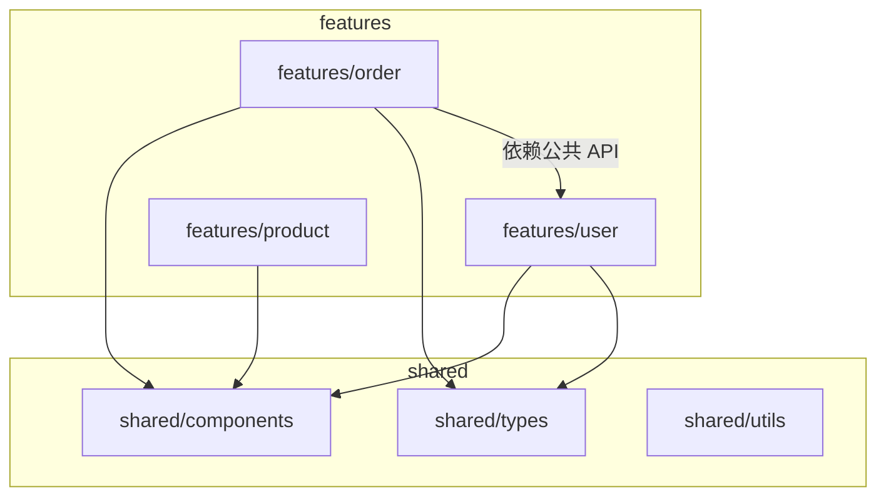
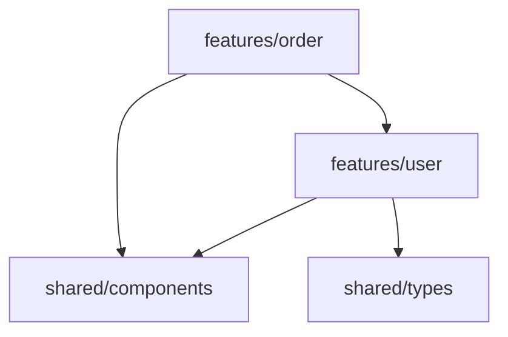
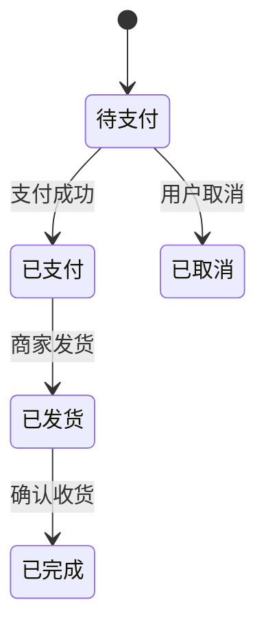
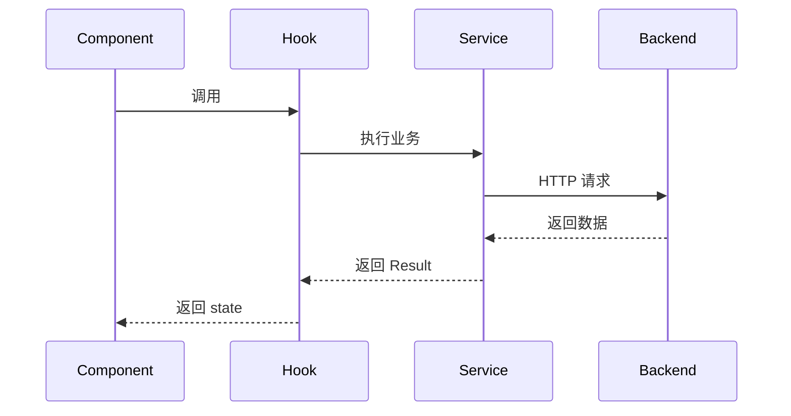
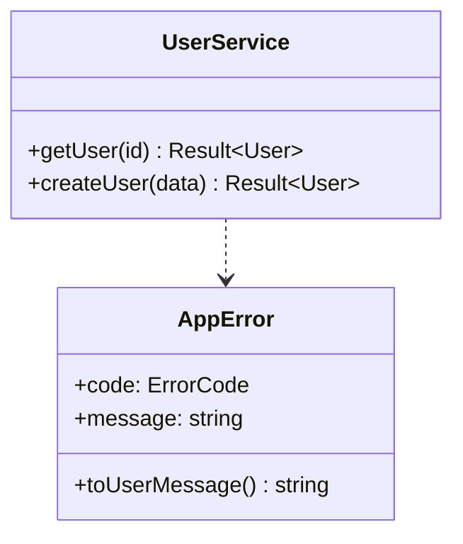

# 可视化架构资产：让 AI "看图写代码"
> 本文是 [架构设计总览](/architecture/overview) 中 ⑤ 可视化架构资产的独立详解。

## 核心思想
把架构信息**画成图**，AI 对图像/图示的理解远好于纯文字。

> [上下文管理策略](/context/management) 中提到：Mermaid 图的 AI 理解度 ，高于纯文字 。

## 3 类可视化资产

### a. Mermaid 图（最推荐）


**AI 的好处**：给 AI 看 Mermaid 图，它能直接理解"模块依赖关系"，比读 500 行 agents.md 还准。

### b. ADR（架构决策记录）
```markdown

# ADR-001: 为什么用 Zustand 而不是 Redux

## 背景
需要轻量级全局状态管理方案

## 决策
使用 Zustand

## 理由
- 零样板代码（Redux Toolkit 仍有大量样板）
- TypeScript 友好
- 与 TanStack Query 互补

## 影响
- AI 生成全局状态时默认 Zustand
- 不引入 Redux Toolkit 依赖
```

**AI 的好处**：每个架构决策都有"理由"，AI 不会乱选工具。

### c. 目录结构图（用 ASCII / Mermaid）
```
src/
├── features/        ← 业务模块（详细见 modules.md）
├── shared/          ← 公共代码
└── ...
```

**AI 的好处**：当 agents.md 引用"目录结构图"时，AI 看到的不是抽象描述，而是"具体的形状"。

## 推荐存放位置
```
docs/
├── architecture/
│   ├── overview.md          # 总览
│   ├── modular-design.md    # 模块化设计
│   ├── modules.md           # 模块图（Mermaid）
│   ├── data-flow.md         # 数据流图
│   └── adr/                 # 架构决策记录
│       ├── 0001-zustand.md
│       ├── 0002-tanstack-query.md
│       └── ...
```

## 在 agents.md 中引用
```markdown

## 架构上下文
- 模块依赖图：@docs/architecture/modules.md
- 数据流图：@docs/architecture/data-flow.md
- 架构决策：@docs/architecture/adr/
```

## Mermaid 图的常见用法

### 模块依赖图（graph TB）


### 状态流转图（stateDiagram-v2）


### 时序图（sequenceDiagram）


### 类图（classDiagram）


## 在 agents.md 中固化
```markdown

## 架构可视化约定
- 模块依赖关系用 docs/architecture/modules.md（Mermaid）描述
- 复杂数据流用 docs/architecture/data-flow.md 描述
- 每个架构决策必须有 ADR（docs/architecture/adr/NNNN-xxx.md）
- 修改架构前先更新 ADR 和图，PR 模板强制要求

## 强制引用
AI 必须读取 @docs/architecture/ 下的所有图和 ADR 再开始编码
```

## 检查清单
- [ ] 有 `modules.md`（模块依赖图）？
- [ ] 有 `data-flow.md`（数据流图）？
- [ ] 有 `adr/` 目录记录每个架构决策？
- [ ] `agents.md` 中引用了这些图？
- [ ] 修改架构时同步更新图和 ADR？

## 相关章节
- [模块化设计](/architecture/modular-design) — 模块图的具体绘制
- [接口契约先行](/architecture/contract-first) — 接口图也是"架构资产"之一